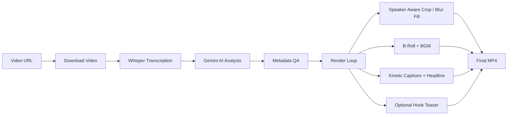

<br />
<div align="center">
  <a href="https://github.com/pdrajan0x/AutoCutClips">
    
  </a>

  <h3 align="center">AutoCutClips</h3>

  <p align="center">
    <strong>Ultimate AI Auto-Clipper & Teaser Generator</strong><br>
    An open-source content factory that turns long-form videos into short-form clips — AI-picked moments, speaker-aware framing, kinetic captions in any language, and scheduled uploads that learn from your channel's results.
    <br />
    <br />
    <a href="README_ID.md">🇮🇩 Baca dalam Bahasa Indonesia</a>
    &middot;
    <a href="https://github.com/pdrajan0x/AutoCutClips/issues/new">Report Bug</a>
    &middot;
    <a href="https://github.com/pdrajan0x/AutoCutClips/issues/new">Request Feature</a>
  </p>
</div>

---

## ✨ Features

| Feature | Description |
|---|---|
| **AI Transcriber** | Word-level transcription using **Faster-Whisper** (large-v3) |
| **AI Content Curator** | **Google Gemini** analyzes context, picks the most viral moments, and generates metadata |
| **Smart Auto-Framing** | Face-tracking via **[MediaPipe BlazeFace (Full-Range)](https://ai.google.dev/edge/mediapipe/solutions/vision/face_detector)** or YOLO, with deadzone smoothing and hard cuts instead of whip-pans |
| **Follow the Speaker** | With two or more people in frame, the camera follows whoever is talking (mouth movement via MediaPipe Face Landmarker) — no HuggingFace token needed |
| **Blurred-Background Fill** | Screen recordings, slides and other faceless footage are fitted over a blurred copy instead of being cropped |
| **Kinetic Captions** | Heavy font, spoken word pops in gold, AI keywords larger; optional UPPERCASE; plus a headline at the top for sound-off viewers |
| **Any Spoken Language** | Captions stay in the spoken language; non-Latin scripts (Hindi, Tamil, Arabic…) are written in English letters, never translated |
| **Hook Teaser (optional)** | `--hook-teaser` opens with a flash-forward to the clip's peak line, then a clean cut |
| **B-Roll Integration** | Auto-fetches contextual stock footage from **Pexels** with crossfade & Ken Burns (Supports Hybrid, Split-Screen & Camera-Switch) |
| **Smart Segment Trimming** | AI dynamically selects the best segments to cut out boring/silent parts |
| **Auto-BGM & Ducking** | Local BGM asset pool (`assets/bgm/`) with 2 modes: *sidechain ducking* (BGM auto-lowers during speech) or *background* (constant low volume). Audio is loudness-normalised to −14 LUFS |
| **Video Queue** | `queue --links links.txt` clips a whole list of videos, resumes after a disconnect, and ranks every clip best-first for upload |
| **Channel Learning** | `learn-youtube` fetches views for uploaded clips; later runs show Gemini what worked on your channel |
| **Auto-Thumbnail** | Frame extraction with dark overlay and large title text (landscape clips — Shorts and Reels ignore custom thumbnails) |
| **Watermark Engine** | Text & image watermarks with adjustable position (9 anchors), padding, opacity, and auto-scaling |
| **Cross-Platform Metadata** | YouTube title/description/tags + TikTok caption — all in English |
| **Auto YouTube Uploader** | Automatically upload highlight clips to YouTube with scheduling support and full metadata (optional) |
| **Auto Instagram Reels Uploader** | Publish Reels to an Instagram Business/Creator account via the Instagram Graph API, with a locally-enforced publish interval (the Graph API itself has no native scheduling) (optional) |
| **Podcast Split-Screen** | Auto speaker diarization via **Pyannote** with top-bottom split-screen layout for podcasts. Works on any vertical/square ratio (`9:16`, `1:1`, `3:4`, `4:5`). Supports **3+ speakers across multiple scenes** with per-speaker frozen frame fallback |
| **Podcast Camera Switch** | Auto active-speaker detection with scene-aware switching — full-frame crop focuses on whoever is talking; blurred pillarbox only when speakers in the same scene talk simultaneously. Works on any vertical/square ratio (`9:16`, `1:1`, `3:4`, `4:5`) |
| **AI Voice-Over** | Converts auto-clips into original commentary/reaction videos using **Gemini** (script generation) and **edge-tts** (free text-to-speech), with a freeze-frame waveform intro |

> 🎬 **NEW: Story Clip Mode (`--story-mode`)**  
> Need to assemble a narrative from multiple specific video sources (like a brand campaign)? We've just introduced the Multi-Source Story Clip Mode!  
> 👉 **[Read the full Story Clip Documentation](docs/STORY_CLIP.md)**

## 📋 Prerequisites

- **Python** 3.10+
- **FFmpeg** installed and available in PATH
- **CUDA GPU** recommended (for Whisper; CPU fallback available)
- **Google Gemini API Key** ([get one here](https://aistudio.google.com/apikey))
- **Pexels API Key** (optional, for B-roll — [get one here](https://www.pexels.com/api/))
- **HuggingFace Token** (optional, for split-screen `diarization` trigger / camera-switch — [get one here](https://huggingface.co/settings/tokens), requires accepting [Pyannote model agreement](https://huggingface.co/pyannote/speaker-diarization-3.1))
- **NVIDIA API Key** (optional, only if using `--ai-provider nvidia` — [get one here](https://build.nvidia.com/))

## ☁️ Running on Google Colab (Recommended)

If you don't have a local GPU, run the pipeline on **Google Colab**'s free T4 GPU with the ready-made notebook
[`notebooks/Lib_AutoCutClips.ipynb`](notebooks/Lib_AutoCutClips.ipynb). It walks through:

1. **Setup** — clone, install, and optionally keep `outputs/` on Google Drive so a disconnect doesn't lose progress
2. **Secrets & cookies** — `GOOGLE_API_KEY`, and a `cookies.txt` so YouTube downloads get past the bot check
3. **Video queue** — paste YouTube links; every video is clipped, and a re-run skips finished ones
4. **Review** — clips ranked best-first with inline previews
5. **Upload** — scheduled YouTube uploads with the OAuth token (cookies cannot upload)
6. **Learn** — fetch your clips' views so later runs favour what works on your channel

The same queue from a terminal:

```bash
python -m app.cli queue --links links.txt --clips 5 --cookies cookies.txt
```

See the [Google Colab Guide](wiki/12-Google-Colab-Guide.md) for details.

---

## 🎬 Web Studio (GitHub Pages + Remote GPU)

The **Clipping Studio** is a browser-based dashboard hosted for free on **GitHub Pages** that connects to a Kaggle/Colab notebook as its backend — giving you a full GUI to control the AI clipping pipeline without any local setup.

**🔗 Open Studio:** [pdrajan0x.github.io/AutoCutClips/studio/](https://pdrajan0x.github.io/AutoCutClips/studio/)

### How It Works

```
┌─────────────────────┐     HTTPS (ngrok)     ┌──────────────────────────┐
│   GitHub Pages      │ ◄──────────────────►   │   Kaggle / Colab         │
│   (Static Frontend) │                        │   (FastAPI + GPU)        │
│                     │   POST /api/jobs       │                          │
│   studio/index.html │ ────────────────────►  │   app/web/api/app.py         │
│   studio/new-job    │   GET  /api/jobs/:id   │   clipping pipeline      │
│   studio/settings   │ ◄────────────────────  │   Whisper + Gemini       │
└─────────────────────┘                        └──────────────────────────┘
        FREE                                           FREE (GPU)
```

### Quick Start

1. **Start the backend** — Open `notebooks/kaggle-studio-server.ipynb` in Kaggle (or Colab), add your API keys to Secrets, and run all cells. Copy the **Public URL** from the output.

2. **Open the Studio** — Visit [the Studio page](https://pdrajan0x.github.io/AutoCutClips/studio/) in your browser.

3. **Connect** — Click the **Connect** button in the sidebar, paste the tunnel URL, and click **Test & Connect**.

4. **Create a job** — Go to **New Job**, enter a YouTube URL, configure your clip settings, and hit **Start Clipping**. Monitor progress in real-time from the Dashboard.

> **Note:** The tunnel URL changes each time the notebook restarts. The Studio saves your last URL in `localStorage` for convenience, but you'll need to update it after each new session.

---

## 🚀 Local Quick Start

```bash
# 1. Clone the repo
git clone https://github.com/pdrajan0x/AutoCutClips.git
cd AutoCutClips

# 2. Install dependencies (pick one)
pip install -r requirements.txt          # pip / Colab
# uv sync                               # or use uv (reads pyproject.toml)

# 3. Set up API keys
cp .env.sample .env
# Edit .env and add your GOOGLE_API_KEY

# 4. Run (Must include --url)
python -m app.cli --url "https://youtube.com/watch?v=VIDEO_ID"
# 5. Examples of Execution

# Standard run (Default options with 5 clips)
python -m app.cli --url "https://youtube.com/watch?v=VIDEO_ID" --clips 5 --ratio 16:9

# Prefer the highest available source quality (the default is 1080p)
python -m app.cli --url "https://youtube.com/watch?v=VIDEO_ID" --source-height max

# Cap source download to 1440p (2K)
python -m app.cli --url "https://youtube.com/watch?v=VIDEO_ID" --source-height 1440

# Sharper output tuning (works for normal and dynamic-split modes)
python -m app.cli --url "https://youtube.com/watch?v=VIDEO_ID" \
  --source-height 2160 \
  --video-cq 19 \
  --video-crf 17 \
  --video-preset slow \
  --video-scale-algo lanczos

# Advanced run (Using YOLOv8 GPU Face Tracking & Custom Fonts)
python -m app.cli --url "https://youtube.com/watch?v=VIDEO_ID" \
  --clips 7 \
  --face-detector yolo \
  --yolo-size 8m \
  --font-style STORYTELLER

# Podcast Split-Screen (2 speakers, 9:16)
python -m app.cli --url "https://youtube.com/watch?v=PODCAST_ID" \
  --clips 3 \
  --ratio "9:16" \
  --split-screen

# Podcast Camera Switch (auto-switches to active speaker, blurred pillarbox on overlap)
python -m app.cli --url "https://youtube.com/watch?v=PODCAST_ID" \
  --clips 3 \
  --ratio "9:16" \
  --camera-switch \
  --switch-hold-duration 2.0 \
  --switch-blend-duration 0.0

# Multi-Speaker Podcast (3 speakers across 2 scenes)
python -m app.cli --url "https://youtube.com/watch?v=PODCAST_ID" \
  --clips 3 \
  --ratio "9:16" \
  --camera-switch \
  --diarization-speakers 3

# Manual Custom Hook (using external .mp4 clip)
python -m app.cli --url "VIDEO_URL" --hook-source "DRIVE_URL_OR_PATH" --hook-source-start 5.0 --hook-duration 4

# Ultra-HD 2K Rendering (Fetch 1440p and render at native 1440p vertical resolution with sharpening)
python -m app.cli --url "VIDEO_URL" --source-height 1440 --render-height source --video-sharpen

# Use NVIDIA NIM (DeepSeek-V3) instead of Gemini
python -m app.cli --url "VIDEO_URL" --ai-provider nvidia --nvidia-model "deepseek-ai/deepseek-v4-pro"

# Square output for Instagram Feed (1:1)
python -m app.cli --url "VIDEO_URL" --ratio "1:1" --clips 5

# Instagram/Facebook portrait (4:5)
python -m app.cli --url "VIDEO_URL" --ratio "4:5" --clips 5

# Classic portrait (3:4)
python -m app.cli --url "VIDEO_URL" --ratio "3:4" --clips 5

# TikTok source
python -m app.cli --url "https://www.tiktok.com/@username/video/1234567890" --source tiktok --clips 3

# Instagram source
python -m app.cli --url "https://www.instagram.com/reel/123456789/" --source instagram --clips 3

# Google Drive source
python -m app.cli --url "https://drive.google.com/file/d/1234567890/view" --source gdrive --clips 3
```

## 🧭 Subcommands

`python -m app.cli <subcommand> ...` (also installed as standalone console scripts, e.g. `clipping`). If the first argument isn't a recognized subcommand, everything is forwarded to the clip/story pipeline:

| Subcommand | Console script | What it does |
|---|---|---|
| `clip` (default) | `clipping` | Auto-clip pipeline |
| `story` | — | Same pipeline, with `--story-mode` implied |
| `queue` | — | Clip every URL in a links file (`--links`, `--retry-failed`, `--keep-source`) |
| `upload-youtube` | `clipping-upload-youtube` | Upload/schedule clips to YouTube |
| `upload-instagram` | `clipping-upload-instagram` | Publish clips as Instagram Reels |
| `reschedule-youtube` | `clipping-reschedule-youtube` | Re-space already-scheduled YouTube videos |
| `youtube-token` | `clipping-youtube-token` | Generate/verify the YouTube OAuth token (`--manual` for Colab) |
| `learn-youtube` | `clipping-learn-youtube` | Fetch views for uploaded clips so clip selection learns from them |
| — | `clipping-tracker` | Run the YouTube Tracker web app |

## ⚙️ CLI Options

```
python -m app.cli --help
```

| Argument | Default | Description |
|---|---|---|
| `--url`, `-u` | — | Video URL to process (Required unless `--story-mode`) |
| `--source` | `youtube` | Video source platform. Choices: `youtube`, `tiktok`, `instagram`, `gdrive`. |
| `--tiktok` | — | **[Deprecated]** Use `--source tiktok` instead |
| `--cookies` | — | Netscape `cookies.txt` for yt-dlp (YouTube bot check on Colab/Kaggle); also `$YTDLP_COOKIES_FILE` |
| `--clips`, `-n` | `7` | Maximum number of clips (fewer when a video has fewer great moments) |
| `--ratio`, `-r` | `9:16` | Output aspect ratio (`9:16`, `16:9`, `1:1`, `3:4`, `4:5`) |
| `--min-duration` / `--max-duration` | `30` / `80` | Clip length bounds in seconds (5-180) |
| `--source-height` | `1080` | Preferred source download max height (`max`, `1080`, `1440`, `2160`, etc.) |
| `--ai-provider` | `gemini` | AI provider for analysis (`gemini` or `nvidia`). |
| `--nvidia-model` | `deepseek...` | Model name for NVIDIA NIM API (e.g. `deepseek-ai/deepseek-v3`). |
| `--render-height` | `1080` | Target render output height (`1080`, `1440`, `2160`, `source`) |
| `--video-bitrate` | `auto` | Target video bitrate (e.g. 8M, 12M, auto). 'auto' scales based on resolution. |
| `--video-sharpen` | — | Apply a subtle sharpening filter for clearer output. |
| `--video-cq` | `23` | NVENC CQ quality target (lower is sharper). [Range: 15-20 (Ultra Sharp), 21-25 (Standard), 26-50 (Blurry)] |
| `--video-crf` | `20` | libx264 CRF quality target (lower is sharper). [Range: 15-20 (Ultra Sharp), 21-25 (Standard), 26-50 (Blurry)] |
| `--video-preset` | `auto` | Encoder preset override (NVENC: `p1`-`p7`, x264: `ultrafast`-`veryslow`). Use `auto` for default. |
| `--video-scale-algo` | `lanczos` | Resize algorithm for render (`lanczos`: sharp, `bicubic`: balanced, `area`/`bilinear`: fast/blurry) |
| `--words-per-sub` | `3` | Max words per caption group |
| `--hook-teaser` | `False` | Open with a flash-forward to the clip's peak line, then a clean cut |
| `--hook-duration` | `3` | Hook teaser duration (seconds) |
| `--font-style` | `DEFAULT` | Font preset (`DEFAULT`, `STORYTELLER`, `HORMOZI`, `CINEMATIC`) |
| `--caption-case` | `normal` | `upper` for UPPERCASE captions |
| `--simple-captions` | — | Plain one-line karaoke captions instead of the kinetic style |
| `--no-title-overlay` | — | Disable the AI headline at the top of the frame |
| `--language` | `auto` | Spoken language code (`hi`, `en`, …); `auto` uses YouTube's language, then Whisper detection |
| `--caption-script` | `latin` | `latin` writes non-Latin speech in English letters (never translated); `native` keeps the script |
| `--no-broll` | — | Disable B-roll footage |
| `--hook-source` | `None` | Google Drive URL or local path for a custom hook video (.mp4), played as the teaser |
| `--hook-source-start` | `0.0` | Start time in seconds for the custom hook video |
| `--no-bgm` | — | Disable background music |
| `--bgm-mode` | `ducking` | BGM mixing mode: `ducking` (sidechain compress — BGM auto-lowers during speech) or `background` (constant low volume mix) |
| `--bgm-dir` / `--bgm-volume` | `assets/bgm` / `0.12` | Your own music folder (mood subfolders) and its volume |
| `--layout` | `auto` | `auto` (face crop, blurred fill for faceless clips), `crop`, or `blur` |
| `--no-speaker-tracking` | — | Follow faces by position instead of by who is talking |
| `--performance-file` / `--no-channel-learning` | `outputs/channel_performance.json` | Channel results from `learn-youtube` shown to the AI, or switch that off |
| `--watermark` | `False` | Enable watermark overlay on rendered clips |
| `--text` | `None` | Watermark text to overlay (e.g. 'Channel Name') |
| `--image` | `None` | Path to watermark image (PNG with alpha recommended, also supports JPG, JPEG, WEBP) |
| `--opacity` | `70` | Watermark opacity in percent (1-100) |
| `--position` | `center-right`| Watermark position (9 anchors: `top-left`, `center-right`, etc.) |
| `--padding` | `0` | Watermark padding from the nearest edge in pixels |
| `--watermark-font-size` | `0` | Watermark font size in pixels (0 = auto ~3% frame height) |
| `--watermark-scale` | `15` | Watermark image height as % of frame height (1-100) |
| `--no-subs` | — | Disable all subtitle rendering |
| `--no-karaoke` | — | No spoken-word highlight |
| `--use-dlp-subs` | — | Also fetch YouTube's subtitles and have Gemini merge them with the Whisper transcript before clip selection (improves accuracy on lyrics/jargon; rendering timing still comes from Whisper) |
| `--face-detector` | `mediapipe` | AI model for face tracking (`mediapipe` or `yolo`) |
| `--static-crop` | `False` | Disable face tracking and use static center crop for `1:1`, `3:4`, and `4:5` formats |
| `--yolo-size` | `8m` | YOLO face track model (`8n`, `8s`, `8m`, `8n_v2`, `9c`) |
| `--whisper-model` | `large-v3` | Whisper model size ([see here](https://github.com/SYSTRAN/faster-whisper?tab=readme-ov-file#whisper) for options) |
| `--whisper-device` | `auto` | Whisper device (`auto` = GPU if available, else CPU; `cuda`, `cpu`) |
| `--whisper-compute-type` | `float16` | Compute type for Whisper (`float32`, `float16`, `int8`, etc.) |
| `--gemini-model` | `gemini-3-flash-preview` | Gemini model name |
| `--gemini-fallback-model` | `gemini-2.5-flash` | Gemini fallback model name if main model fails |
| `--load-gemini-json` | `False` | Load the saved `gemini_response.json` from the output directory to bypass the Gemini API call |
| `--split-screen` | `False` | Enable split-screen mode for podcasts (any vertical/square ratio — `9:16`, `1:1`, `3:4`, `4:5`; `--split-trigger diarization` requires `HF_TOKEN`). Supports 3+ speakers across multiple scenes |
| `--dynamic-split` | `False` | Automatically switch between full-screen and split-screen based on activity (requires `--split-screen`) |
| `--split-trigger` | `diarization` | Trigger for splitting: `diarization` (audio-based) or `face` (visual count) |
| `--diarization-speakers` | `auto` | Number of speakers for diarization (set to `3` for exact 3 speakers, or `auto` for visual AI auto-detection) |
| `--camera-switch` | `False` | Enable camera-switch mode for podcasts — full-frame crop switches to the active speaker; blurred pillarbox on simultaneous speech (any vertical/square ratio — `9:16`, `1:1`, `3:4`, `4:5`; requires `HF_TOKEN`) |
| `--switch-hold-duration` | `2.0` | Min seconds to hold on current speaker before switching (camera-switch only) |
| `--switch-blend-duration` | `0.0` | Transition duration when switching speakers (0 = instant snap, 0.2 = smooth blend) |
| `--split-zoom` | `1.0` | Manual zoom factor for split-screen panels (e.g. 1.2, 1.5) |
| `--split-v-align` | `0.5` | Vertical alignment for split-screen panels (0.0=top, 0.5=center, 1.0=bottom) |
| `--split-auto-zoom` | `False` | **[New]** Automatically zoom into each panel to separate speakers for a clean frameless look |
| `--split-max-zoom` | `2.5` | Maximum zoom limit allowed for auto-zoom (default: 2.5) |
| `--track-step` | `None` | Face detection frequency in seconds (default: `0.25`) |
| `--track-deadzone` | `None` | Camera deadzone ratio where subject stays centered (default: `0.15`) |
| `--track-smooth` | `None` | Camera catch-up speed factor (default: `0.30`) |
| `--track-jitter` | `None` | Pixel threshold to ignore micro-shakes (default: `5`) |
| `--track-snap` | `None` | Jump threshold (fraction of frame width) for a hard cut (default: `0.08`) |
| `--track-conf` | `0.55` | **[Experimental]** Face detection confidence threshold (raise to prevent ghosts) |
| `--track-smooth-window` | `12` | **[Experimental]** Frame window for layout stability (12 frames ≈ 0.5s) |
| `--scene-cut-threshold` | `18` | **[Experimental]** Sensitivity for camera-cut detection (instantly resets history) |
| `--track-iou-threshold` | `0.2` | **[Experimental]** Overlap threshold for merging duplicate detections |

## 📐 Aspect Ratios

AutoCutClips supports **5 output aspect ratios**. All vertical/square ratios include **face-tracking** by default to keep the subject centered.

| Ratio | Output | Face Tracking | Best For |
|---|---|---|---|
| `9:16` | 1080×1920 | ✅ Yes | TikTok, Reels, YouTube Shorts |
| `16:9` | 1920×1080 | ❌ No (blurred fill if the source shape differs) | YouTube, Landscape content |
| `1:1` | 1080×1080 | ✅ Yes (can disable via `--static-crop`) | Instagram Feed, Twitter/X |
| `3:4` | 1080×1440 | ✅ Yes (can disable via `--static-crop`) | Instagram Portrait, Pinterest |
| `4:5` | 1080×1350 | ✅ Yes (can disable via `--static-crop`) | Instagram/Facebook Feed |

> [!NOTE]
> Footage that doesn't fit the frame — a vertical source in `16:9`, or a faceless screen recording in `9:16` — is fitted over a **blurred, darkened copy of itself** instead of black bars or a bad crop. Force it with `--layout blur`.

## 🎙️ Podcast Modes

When processing podcast videos, you can choose between several intelligent rendering modes. These modes support **3+ speakers across multiple scenes**.

### 1. **`--split-screen` (Split Layout)**
Divides the screen into panels to show multiple speakers simultaneously.
*   **Default:** Permanent **Top-Bottom** layout (supports 3+ speakers via panel-swapping).
*   **`--dynamic-split`:** Automatically switches between **Full 9:16** (when 1 person is talking/visible) and **Split** (when 2+ are active).
*   **Trigger Modes (`--split-trigger`):**
    *   **`diarization` (Default):** Uses audio to know who is talking. Requires `HF_TOKEN`. Dimming effect on inactive speaker.
    *   **`face`:** Uses visual face count. **No token required**. No dimming effect.
*   **Optimization Features:**
    *   **Smart Separation Zoom (`--split-auto-zoom`):** Dynamically adjusts the zoom level of each panel to keep the framing tight on the speaker while excluding other detected faces. Ensures no "overlap" even when subjects are sitting close together.
    *   **Vertical Tracking:** Automatically follows face height, keeping the subject centered vertically (adjustable via `--split-v-align`).
*   **Best for:** Educational podcasts or when reaction shots are important.

### 2. **`--camera-switch` (Cinematic Switching)**
Mimics professional editing by focusing only on the active speaker in full screen.
*   **View:** **Full 9:16** that cuts between speakers.
*   **Scene-Aware:** Automatically uses **Blurred Pillarbox** if two people in the same wide-shot are talking; otherwise stays in clean full-crop.
*   **Best for:** Storytelling, interviews, or high-energy clips.

---

### **Comparison Table**

| Feature | `--split-screen` | `--camera-switch` |
| :--- | :--- | :--- |
| **Visual Layout** | Split (Top-Bottom) | Full Screen (Switching) |
| **Dynamic Mode** | ✅ `--dynamic-split` (Auto-toggle) | ✅ Always Dynamic |
| **Trigger Source** | Audio or Visual (`--split-trigger`) | Audio Only (Diarization) |
| **Reaction Shots** | ✅ Both speakers visible | ❌ Only 1 speaker visible |
| **Requirement** | Optional `HF_TOKEN` (Visual mode needs no token) | `HF_TOKEN` (Required) |

> [!TIP]
> Use `--split-screen --dynamic-split --split-trigger face` for the fastest rendering without needing any special API tokens or Diarization models.

---

## 🚀 Quick Start Examples

```bash
# 1. Standard AI Clipping (7 clips, 9:16)
python -m app.cli --url "VIDEO_URL"

# 2. Dynamic Split-Screen (Visual-based, NO TOKEN REQUIRED)
python -m app.cli --url "VIDEO_URL" --split-screen --dynamic-split --split-trigger face

# 3. Dynamic Split-Screen (Audio-based, Highlight active speaker, needs HF_TOKEN)
python -m app.cli --url "VIDEO_URL" --split-screen --dynamic-split --split-trigger diarization

# 4. Cinematic Camera Switch (Needs HF_TOKEN)
python -m app.cli --url "VIDEO_URL" --camera-switch

# 5. Smart Separation Split-Screen (Auto-Zoom & Vertical Track)
python -m app.cli --url "VIDEO_URL" --split-screen --dynamic-split --split-trigger face --split-auto-zoom --split-v-align 0.4

# 6. Square output (1:1) with Split-Screen
python -m app.cli --url "VIDEO_URL" --ratio "1:1" --split-screen --dynamic-split --split-trigger face

# 7. Aggressive silence trimming, shorter clips
python -m app.cli --url "VIDEO_URL" --silence-trim --min-duration 15 --max-duration 45

# 8. Flash-forward teaser + uppercase captions
python -m app.cli --url "VIDEO_URL" --hook-teaser --caption-case upper

# 9. Hindi video: captions in English letters ("mera naam ... hai")
python -m app.cli --url "VIDEO_URL" --language hi

# 10. A whole list of videos
python -m app.cli queue --links links.txt --clips 5
```

> [!IMPORTANT]
> Audio-based features (diarization) require a **HuggingFace Token** (`HF_TOKEN`) in your `.env` file and acceptance of the Pyannote model agreement on HuggingFace.

## 🗣️ AI Voice-Over Commentary

Prevent YouTube copyright/reused content strikes by turning raw clips into **original commentary/reaction videos** automatically.

When you pass the `--voiceover` flag, the pipeline will:
1. Generate a sharp, opinionated analysis script using **Gemini AI** based on the clip's specific transcript.
2. Synthesize the script into natural-sounding speech using **edge-tts** (free, no GPU required).
3. **Duck** the original video's audio down to 15% volume and overlay the AI voice-over at 100% volume.
4. **Override** the burned-in karaoke subtitles so they display the AI narrator's words instead of the original video transcript.
5. **Visual Intro**: A darkened freeze frame with a relaxed audio waveform while the narrator speaks.

**Example Usage:**
```bash
# Basic voice-over (Uses default en-US-AvaNeural and English language)
python -m app.cli --url "VIDEO_URL" --voiceover

# Voice-over in Indonesian with reaction style
python -m app.cli --url "VIDEO_URL" --voiceover --voiceover-lang id --voiceover-voice id-ID-ArdiNeural --voiceover-style reaction
```

**Config Options:**
- `--voiceover-voice`: Choose the TTS voice (e.g. `en-US-AvaNeural`, `id-ID-GadisNeural`).
- `--voiceover-lang`: Script language (`en` or `id`).
- `--voiceover-style`: `analysis` (default), `reaction`, `lesson`, or `summary`.
- `--voiceover-length`: Length of the script (`short` [default: 5-15s], `normal` [20-40s], `long` [40-60s]).
- `--voiceover-volume`: Volume of narrator (default 1.0).
- `--original-volume`: Volume of ducked video audio (default 0.15).

## 🎵 BGM (Background Music) Settings

- `--no-bgm` : Disable the BGM feature entirely.
- `--bgm-mode ducking` *(default)* : **Sidechain Ducking** mode — BGM volume automatically lowers when the speaker is talking, then rises during pauses. Provides a professional effect like premium podcasts/YouTube videos.
- `--bgm-mode background` : **Constant Background** mode — BGM plays at a stable, low volume throughout the video without dynamic adjustments. Best for content with few pauses.

> 📁 **BGM Setup:**
> Place your royalty-free `.mp3` files into the `assets/bgm/<mood>/` folder (e.g., `assets/bgm/chill/`, `assets/bgm/epic/`, `assets/bgm/sad/`, `assets/bgm/upbeat/`, `assets/bgm/suspense/`). The script will **randomly** select a song from the mood folder requested by the AI. If the folder is empty, BGM will be skipped automatically.
>
> BGM files shorter than the video will be **auto-looped** (`-stream_loop -1`).
>
> See `assets/bgm/README.md` for recommended sources to download free BGM.

## 🎬 Segment Trimming & Hook Teaser

### Final Video Structure

```
[Hook Teaser (optional)] → [MAIN CLIP] → done
         ↑                      ↑
   --hook-teaser         This part is affected by Segment Trimming
```

By default every clip opens directly on its strongest line. With `--hook-teaser`, a short flash-forward to the clip's
peak line plays first, followed by a clean cut to the clip (it is skipped when that line already opens the clip).

### Segment Trimming

Segment Trimming applies to the **main clip**. AI analyzes it and **removes** boring sections — they're not sped up, they're **cut out entirely**, and the good parts are stitched together seamlessly.

```
Example:
  Main clip: second 30 - 90 (60 seconds total)
  
  AI finds:
    ✅ Second 30-55 : strong content, engaging
    ❌ Second 55-58 : speaker pauses/filler (removed)
    ✅ Second 58-90 : strong punchline

  Result: segment 1 + segment 2 joined directly
  Final duration: 57 seconds (3 seconds of filler removed)
```

### Flag Comparison

| Flag | Behavior | Affected Part |
|---|---|---|
| *(default, no flag)* | AI smart-trims boring/filler sections | Main clip only |
| `--silence-trim` | AI trims more aggressively — pauses >0.5s removed | Main clip only |
| `--no-segment-trim` | No trimming, full start-to-end render | Main clip only |

> [!NOTE]
> - If AI determines the entire clip is already tight and engaging, `keep_segments` will contain a single segment spanning the full duration (same effect as `--no-segment-trim`).
> - A trim that would leave the clip shorter than `--min-duration` is ignored, and the full clip renders instead.

---

## 🐍 Recommended Configurations (Notebook/Colab)

These are verified configurations for optimal results in different scenarios.

### 1. Standard Mode (Standard Clipping)
Best for general videos where you want the best accuracy and focus.
```python
# Constants for Standard Clipping
URL_YOUTUBE = "https://www.youtube.com/watch?v=UXhdIF8kvCI"
JUMLAH_CLIP = 7
RASIO = "9:16"
FONT_STYLE = "DEFAULT"
GEMINI_MODEL = "gemini-2.0-flash"

!python -m app.cli \
  --url "{URL_YOUTUBE}" \
  --clips {JUMLAH_CLIP} \
  --ratio "{RASIO}" \
  --font-style "{FONT_STYLE}" \
  --hook-duration 3 \
  --words-per-sub 5 \
  --face-detector yolo \
  --gemini-model "{GEMINI_MODEL}" \
  --no-bgm \
  --no-subs \
  --no-broll \
  --use-dlp-subs
```

### 2. Split-Screen Mode (Podcasts)
Optimized for podcasts with 2+ speakers using stable YOLO detection.
```python
# Constants for Split-Screen
URL_YOUTUBE = "https://www.youtube.com/watch?v=UXhdIF8kvCI"
JUMLAH_CLIP = 3
RASIO = "9:16"
FONT_STYLE = "DEFAULT"
GEMINI_MODEL = "gemini-2.0-flash"

!python -m app.cli \
  --url "{URL_YOUTUBE}" \
  --clips {JUMLAH_CLIP} \
  --ratio "{RASIO}" \
  --font-style "{FONT_STYLE}" \
  --hook-duration 3 \
  --words-per-sub 5 \
  --gemini-model "{GEMINI_MODEL}" \
  --no-bgm \
  --no-subs \
  --no-broll \
  --split-screen \
  --dynamic-split \
  --split-trigger face \
  --face-detector yolo \
  --use-dlp-subs
```

## 📂 Project Structure

```text
AutoCutClips/
├── pyproject.toml           # Dependencies, metadata & console scripts
├── .env.sample              # API key template
├── .gitignore
├── README.md                # English docs
├── README_ID.md             # Indonesian docs
├── sources.json             # Story Clip Mode: video source registry
├── story_recipe.json        # Story Clip Mode: clip assembly recipe
├── upload_safety.json       # YouTube uploader safety rails
└── app/
    ├── cli.py                # CLI entry point (python -m app.cli)
    ├── clipping/
    │   ├── config.py         # Master configuration & argparse
    │   ├── runner.py         # Pipeline orchestrator
    │   ├── story_runner.py   # Story Clip Mode orchestrator
    │   ├── story/            # Story mode helper modules
    │   ├── engine/           # Download → Transcribe → Gemini/NVIDIA AI
    │   └── studio/           # Video render engine modules
    ├── uploaders/            # YouTube + Instagram upload & scheduling logic
    ├── tracker/              # YouTube Tracker web app
    └── web/                  # Web API for the Studio (static pages in docs/studio)
```

## 📊 Results

| 1 video 9:16 | 1 video split from youtube shorts link |
|:---:|:---:|
| <a href="https://www.youtube.com/shorts/hTtU4iI-aKA"></a><br><br>[**Watch Example**](https://www.youtube.com/shorts/hTtU4iI-aKA)<br>*(Standard 9:16 Auto-Framing)* | <a href="https://www.youtube.com/shorts/RnoJqC8Yur4"></a><br><br>[**Watch Example**](https://www.youtube.com/shorts/RnoJqC8Yur4)<br>*(Split-Screen Podcast Mode)* |

## 🔄 Pipeline Flow



## 📤 Output

For each clip, the pipeline creates an `outputs/` directory and generates:

| File | Description |
|---|---|
| `outputs/highlight_rank_N_ready.mp4` | Final rendered clip with subtitles, B-roll, BGM |
| `outputs/thumbnail_rank_N.jpg` | Auto-generated thumbnail with title text (landscape ratios only) |
| `outputs/transcript_cache.json` | Saved transcript, reused when the same video is re-run |
| `outputs/render_manifest.json` | Manifest with metadata for all clips |
| `outputs/metadata_preview.json` | Gemini-generated metadata (titles, tags, captions) |

## 🎵 Font Styles

| Style | Main Font | Emphasis Font | Best For |
|---|---|---|---|
| `DEFAULT` (default) | Montserrat Black | Montserrat Medium | General purpose — heaviest, most readable |
| `HORMOZI` | Montserrat | Anton | Business / motivational |
| `STORYTELLER` | Inter | Lora | Narrative / storytelling |
| `CINEMATIC` | Roboto | Bebas Neue | Film / dramatic |

## 📺 Auto-Upload to YouTube

The project includes a standalone YouTube auto-uploader with scheduling support!

1. Generate your OAuth token: `python -m app.uploaders.youtube_token generate` (see the [YouTube API Setup Guide](wiki/15-YouTube-API-Setup-Guide.md) for the full walkthrough). This writes `.credentials/youtube_token.json` directly.
2. After the rendering process finishes, the uploader automatically reads from the generated `outputs/` directory (e.g., `outputs/render_manifest.json` and the final videos). Simply run it:
   ```bash
   # Basic run (uses the default 24-hour interval, gated by upload_safety.json)
   python -m app.cli upload-youtube

   # Or run with custom arguments (example):
   python -m app.cli upload-youtube --interval-hours 12 --tz-name "Asia/Kolkata"
   ```
3. To run a test with only the first video, use `python -m app.cli upload-youtube --test-mode`. Run `python -m app.cli upload-youtube --help` to see all scheduling, safety-config, and timezone options.
4. To re-space videos that are still scheduled/private, use `python -m app.cli reschedule-youtube [--apply]` (dry-run by default).
5. Once uploads have been public for a couple of days, run `python -m app.cli learn-youtube`. It saves each clip's views to `outputs/channel_performance.json`, and later clip runs show Gemini the channel's best and weakest clips (from 6 public clips upward).

Uploads carry the clip's hashtags in the description and tags, and set `defaultAudioLanguage` to the detected spoken language. Clips already uploaded are skipped on the next run.

## 📘 Auto-Upload to Instagram (Reels)

The project also includes a standalone Instagram Reels publisher built on the **Instagram Graph API**. It replaces the project's older Facebook Page Reels uploader — there is no Facebook Page uploader anymore.

**Prerequisites:**
- An Instagram Business/Creator account linked to a Facebook Page.
- A long-lived access token with the `instagram_content_publish` permission.
- Set `IG_USER_ID` (the Instagram **User** ID, not the Facebook Page ID) and `IG_ACCESS_TOKEN` in your `.env` file. `IG_GRAPH_VERSION` (default `v25.0`) and `IG_PUBLIC_BASE_URL` are optional. The older `META_PAGE_ACCESS_TOKEN` / `META_GRAPH_VERSION` variables still work as fallbacks.

**How it works:**
1. Validates the access token against the Graph API.
2. Creates a media container (`media_type=REELS`) — either via `video_url` (if `IG_PUBLIC_BASE_URL` is set) or a resumable binary upload.
3. Polls the container until it's `FINISHED`, then publishes it.
4. Because the Graph API has **no** native scheduled-publish parameter, `--interval-hours` is enforced locally: clips whose slot hasn't arrived are marked `deferred` and published by a later run (e.g. from cron). Pass `--publish-now` to ignore the interval and publish the whole batch back to back.
5. If a publish fails, the batch **stops immediately** rather than continuing to hammer the API.

```bash
# Basic run (reads .env for IG_USER_ID & IG_ACCESS_TOKEN)
python -m app.cli upload-instagram

# Test mode — only publish the first clip
python -m app.cli upload-instagram --test-mode

# Custom interval (3 hours between Reels)
python -m app.cli upload-instagram --interval-hours 3

# Ignore the interval and publish the whole batch back to back
python -m app.cli upload-instagram --publish-now

# See all options
python -m app.cli upload-instagram --help
```

| Argument | Default | Description |
|---|---|---|
| `--manifest-file` | `outputs/render_manifest.json` | Input manifest from the clipping pipeline |
| `--result-file` | `outputs/ig_upload_results.json` | Output JSON trace file |
| `--updated-manifest` | `outputs/render_manifest_ig_uploaded.json` | Updated manifest with publish status |
| `--tz-name` | `$APP_TIMEZONE` or `Asia/Kolkata` | Timezone for the interval maths (IANA format) |
| `--interval-hours` | `5` | Minimum gap between publishes (hours) |
| `--test-mode` | `false` | Publish only the first pending item |
| `--publish-now` | `false` | Ignore the interval and publish the whole batch back to back |

See the [Instagram Reels Uploader wiki page](wiki/16-Instagram-Reels-Uploader.md) for the full publishing-flow details and rate limits.

## 🧹 Disk Cleanup

Since the pipeline downloads full source videos and creates intermediate files (wav, chunks, transcripts), the `outputs/` and `uploads/` directories can grow very large over time. 

We provide a simple bash script to safely clean up all temporary files while preserving your final generated clips and job history (`jobs.json`):

```bash
bash cleanup.sh
```

## ❤️ Support & Contributing

Feel free for contributing, support, fork, likes, etc. Any feedback is greatly appreciated to keep this open-source project growing!

- **Saweria:** [https://saweria.co/pdrajan0x17](https://saweria.co/pdrajan0x17)
- **Ko-fi:** [https://ko-fi.com/naufalrizqullah](https://ko-fi.com/naufalrizqullah)

## 📄 License

Open source. Feel free to use, modify, and distribute.
